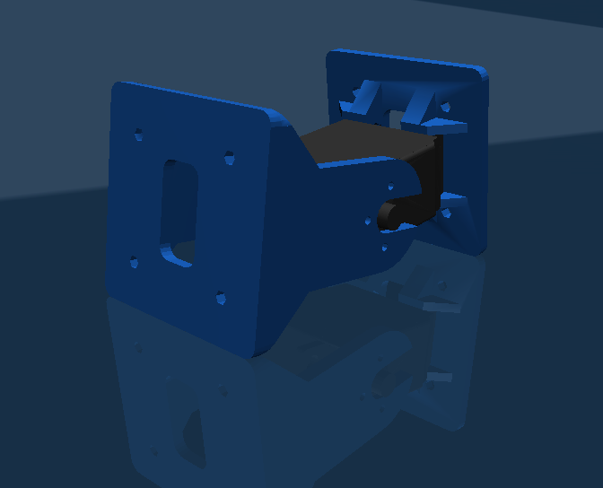
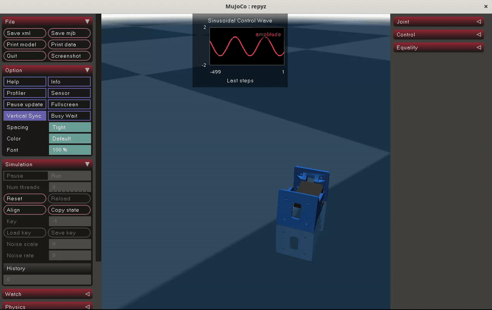

# REPYZ Minicube - MuJoCo Simulation

This project contains a physical simulation of the modular REPYZ module (also known as Minicube) developed for the MuJoCo physics engine. The model includes an exact assembly based on the original FreeCAD STL meshes, replicating the servo pivot and kinematics.

This is based on the [REPYZ modules](https://github.com/Obijuan/REPYZ) originally developed by [Obijuan](https://github.com/Obijuan/)




## Prerequisites

- Python 3 (Tested on Python 3.10+)
- Operating System: Linux

## Environment Installation

To avoid dependency conflicts with other packages in your system, it is recommended to isolate the project in a virtual environment (`venv`). We have prepared a script that automates this process by installing the exact dependencies (MuJoCo and NumPy).

1. Give execution permissions to the installation script (Linux/Mac only):
   ```bash
   chmod +x install_venv.sh
   ```
2. Run the script:
   ```bash
   ./install_venv.sh
   ```

## Execution

Each time you open a new terminal to work on the project, remember to **activate the virtual environment** before running any Python scripts:

```bash
source venv/bin/activate
```

To launch the classic MuJoCo interactive environment with the assembled model, run the main script:

```bash
python3 visualize.py
```

If you experience slowness (especially through VNC) or prefer to visualize the robot in a browser tab without lag, you can launch the Viser web server:

```bash
python3 visualize.py --viewer viser
```
Once executed, open `http://localhost:8080` in your browser.





## Roadmap

 * Build DRL environment to teach REPYZ modules how to 'walk'
 * Build simultaneous environments for training using MJX (MuJoCo XLA)